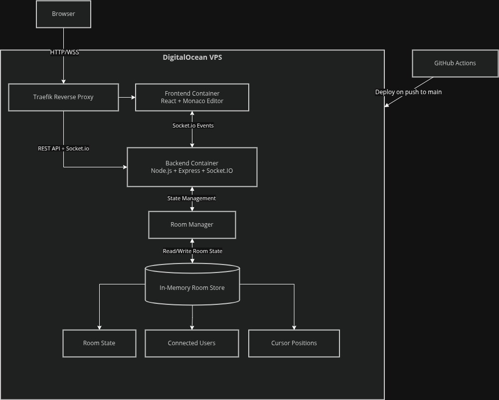

# CodeCollab

A real-time collaborative code editor where multiple users can write code together, see each other's changes instantly, track live cursor positions, and execute code in a shared workspace

**Live Demo:** https://cc.sivv.me


---

## Why I Built This

I wanted to understand how collaborative environments worked beneath the surface

While libraries such as Yjs, Liveblocks, and ShareDB solve many synchronization challenges, I intentionally built the first version from scratch using Socket.io and an in-memory room model to explore the engineering challenges involved in keeping multiple clients synchronized in real time

The project focuses on questions such as:

- How do multiple users edit the same document simultaneously?
- How can updates be synchronized without creating duplicate events?
- How do collaborative editors maintain responsiveness while minimizing latency?
- What tradeoffs exist between simple synchronization approaches and production-grade solutions like CRDTs?

CodeCollab was built as a practical way to explore real-time synchronization, collaborative editing, and distributed state management

---

## Features

- Real-time collaborative editing
- Live cursor tracking with user-specific colors
- Shared language synchronization
- Room ownership and participant moderation
- User kick functionality
- Automatic room recovery for 5 minutes after disconnect
- Dockerized deployment
- CI/CD pipeline with automated testing
- Backend unit test coverage using Vitest

---

### The Core Problem

A collaborative editor has a fundamentally different state model from a traditional web application

Each participant maintains a local copy of the document. Whenever a user types, the change must propagate to every connected client while maintaining responsiveness and avoiding duplicate updates

Even for a simple editor, synchronization introduces challenges around latency, ordering, ownership, and conflict resolution

---

### Current Synchronization Strategy

Each edit emits the latest document state to the server

The server updates the room's in-memory code buffer and broadcasts the latest state to all other connected clients

---

### Why In-Memory Storage

This approach was intentionally chosen to prioritize simplicity and real-time collaboration

Rooms remain available for five minutes after the final participant disconnects, allowing users to reconnect and continue working. After that period, the room is automatically removed.

This design keeps the architecture lightweight while leaving room for future persistence strategies such as snapshots

---

### Why Full Document Sync Instead of Deltas

The current implementation broadcasts the entire document after every change rather than incremental edits

Advantages:

- Simple implementation
- Easy to reason about
- Reliable for small and medium-sized files

Tradeoffs:

- Increased bandwidth usage as document size grows
- Does not scale well to very large files

While production-grade collaborative editors typically rely on operational transforms or CRDT-based approaches, a simpler synchronization strategy was chosen to focus on understanding the fundamentals of real-time state sharing

---

## Known Limitation: Concurrent Edits

The current synchronization model follows a **last-write-wins** approach

If two users edit the same document simultaneously, the most recent update received by the server becomes the source of truth

This can result in one user's changes being overwritten

---

## Future Improvement: CRDT-Based Synchronization

The long-term solution is migrating to **Yjs**, a CRDT (Conflict-free Replicated Data Type) framework

Benefits include:

- True collaborative editing
- Automatic conflict resolution
- Built-in cursor awareness
- Elimination of last-write-wins conflicts
- Better scalability for larger collaborative sessions

With Yjs, synchronization becomes a property of the data structure itself rather than custom application logic

---

## Infrastructure

## 

### Tech Stack

- React + Vite
- Monaco Editor
- Node.js + Express
- Socket.io
- Docker
- Traefik
- DigitalOcean
- GitHub Actions
- Vitest

---

## Running Locally

### With Docker

```bash
docker compose up --build
```

### Without Docker

```bash
# Backend
cd backend
npm install
npm start

# Frontend
cd frontend
npm install
npm run dev
```

---

## To Do

- API integration for code execution
- Execution history panel
- Yjs CRDT migration
- Persistent room snapshots
